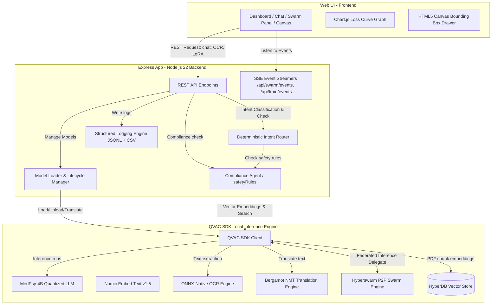
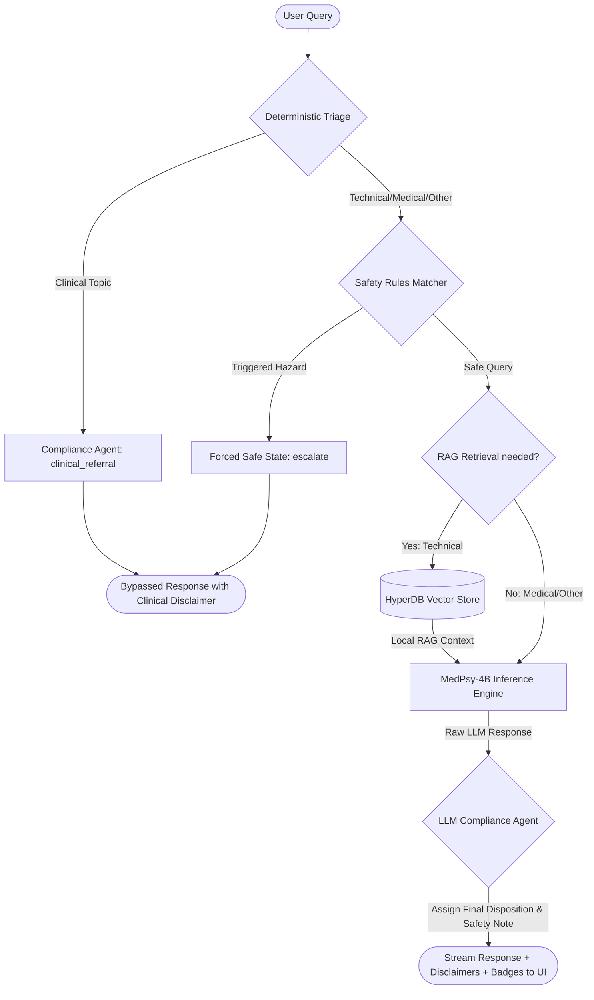
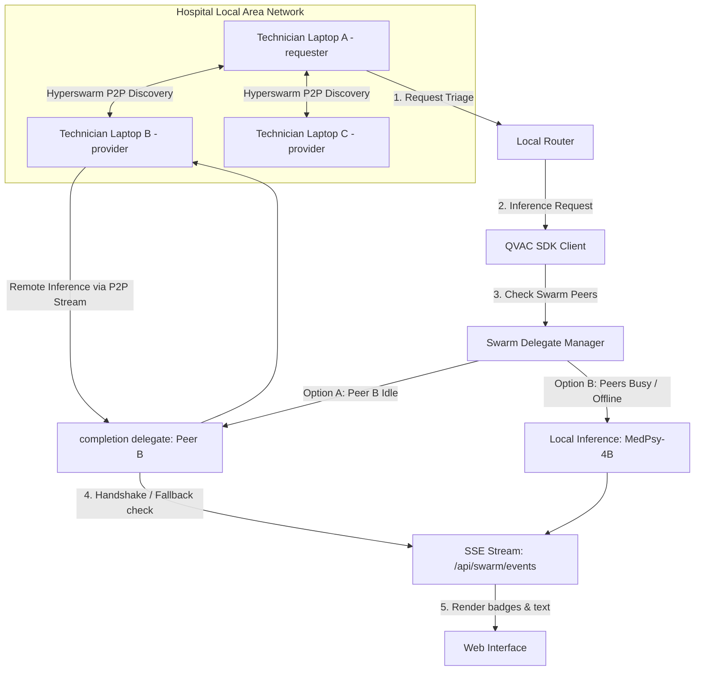
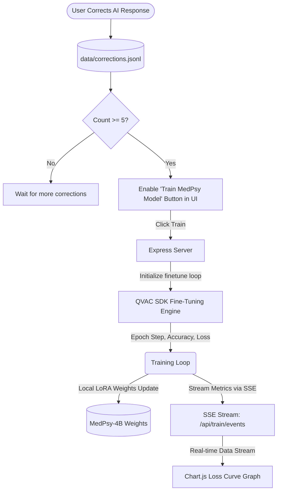

# 🏗️ BioMed AI - System Architecture & Workflows

This document provides detailed architectural diagrams and workflow specifications for the core subsystems of **BioMed AI**. 

---

## 🗺️ System Architecture Overview

BioMed AI is built on four core local Pillars designed to run completely offline on consumer hardware. The relationship between the Web Interface, the Express Backend, and the local QVAC SDK Inference Engines is illustrated below:

---

## 🔄 1. Multi-Agent Triage & Request Validation Lifecycle

This diagram illustrates how a technician's query flows through the system, including deterministic triage, programmatic safety rules checking, RAG manual context retrieval, MedPsy-4B LLM completion, and final compliance validation before streaming to the UI.

### Key Stages:
1. **Deterministic Triage:** Keyword-based routing immediately isolates clinical queries, forwarding them to the compliance agent to safeguard against clinical misdiagnoses.
2. **Programmatic Safety Checks:** Scans queries and evidence against critical edge-case safety rules (e.g. high-voltage discharge, oxygen hydrocarbon contamination, laser safety) to preemptively flag hazardous activities.
3. **HyperDB Retrieval:** Technical queries perform a semantic embedding lookup via the local vector database, injecting relevant manual snippets directly into the prompt context.
4. **Compliance Validation:** The final output is checked by an LLM-based compliance validator to extract the final disposition (`swap_test`, `recalibrate`, `escalate`, etc.) and append any required safety disclaimers.

---

## 🌐 2. P2P Swarm & Federated Inference Architecture

When multiple technicians operate on the same hospital local network, BioMed AI uses **Hyperswarm** to share compute loads and delegate inference calls automatically.

### Key Features:
* **Zero Configuration:** Technicians discover each other automatically using local network peer discovery via DHT and multicast DNS.
* **Automatic Fallback:** If a remote peer fails to respond or is disconnected, the QVAC SDK automatically falls back to local execution on Laptop A without interrupting the technician's workflow.
* **Swarm Diagnostics:** SSE connection events stream to the UI in real time, updating the swarm dashboard with the number of connected peers and active delegation handshakes.

---

## 📈 3. Local LoRA Fine-Tuning & Loss Streaming

Technicians can refine the diagnostics by providing corrections. Once enough corrections are saved, the local LoRA training cycle begins, streaming live training loss metrics directly to a Chart.js interface.

### Key Workflow:
1. **Correction Capture:** Technician adjustments to diagnostic reasoning are stored locally in JSONL format.
2. **LoRA Fine-Tuning Trigger:** When at least 5 corrections accumulate, the UI enables training.
3. **Training Execution:** The backend initializes the QVAC fine-tuning adapter, training the model locally.
4. **Real-time Charting:** Epoch step index, accuracy, and loss metrics are piped to the client via a SSE channel and rendered on a Chart.js line graph, visualizing model convergence.
