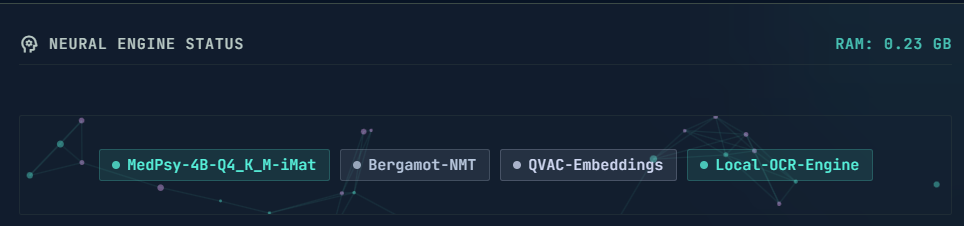
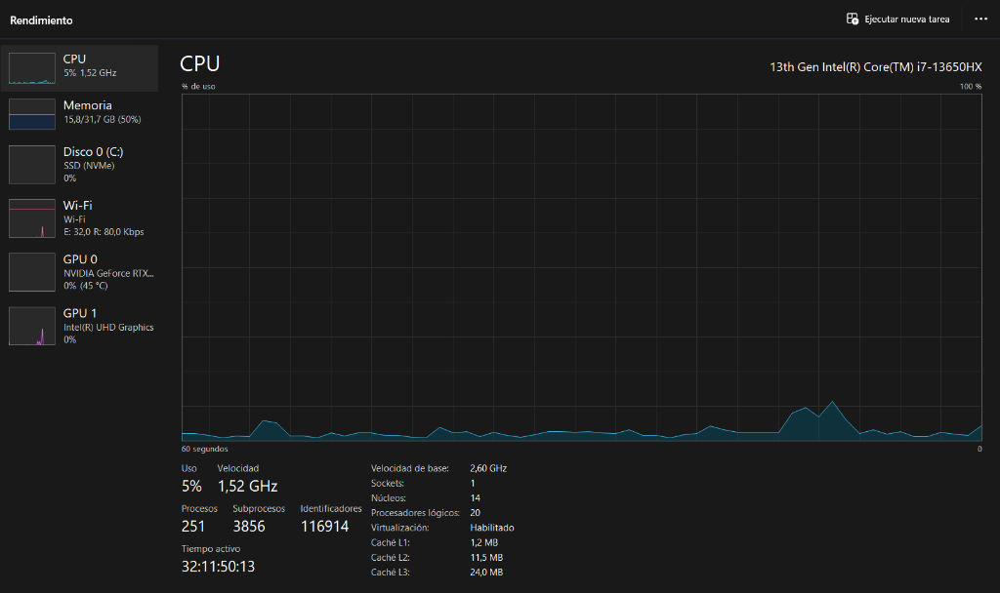
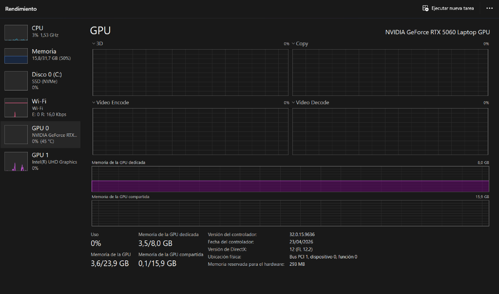

<p align="center">
  
</p>

<h1 align="center">⚕️ BioMed AI</h1>

<p align="center">
  <strong>Premium Local Edge AI Copilot for Biomedical Equipment Technicians</strong>
</p>

<p align="center">
  <a href="LICENSE"></a>
  <a href="https://docs.qvac.tether.io"></a>
  <a href="https://dorahacks.io/hackathon/qvac-unleach-edge-ai-i"></a>
</p>

<p align="center">
  Designed to operate entirely offline inside hospital workshop LANs. Integrates advanced local P2P swarm federation, real-time on-device LoRA fine-tuning, and ONNX-native OCR bounding box analysis.
</p>

---

## 🛑 Important Medical Disclaimer

> [!WARNING]
> **This tool is for biomedical engineering reference and support purposes only.**  
> It does not provide clinical diagnosis or treatment recommendations. Always verify service logic, schematic pinouts, and calibration procedures with official manufacturer specifications.

---

## 🌟 Hackathon Tracks & Alignment

BioMed AI complies strictly with all rules of the **QVAC Hackathon: Unleash Edge AI**. It is submitted under the following tracks:
*   **🧠 MedPsy Track**: Heavily utilizes the **MedPsy-4B** specialized model for technical-clinical triage and medical-grade troubleshooting diagnostics.
*   **💻 General Purpose Track**: Highly optimized to run on local retail devices and technician laptops (up to 32 GB RAM).
*   **🔧 Tinkerer Track**: Featuring a lightweight, quantized on-device footprint (~4.6 GB RAM total) that allows it to execute cleanly on single-board computers (SBCs) and low-power units.

---

## 🏗️ System Architecture: The 4 Local Columns

All inference, embeddings, vector databases, and model training tasks are executed **100% locally on-device by the QVAC SDK and QVAC RAG**. There are zero mocks and zero cloud dependencies.

```
┌─────────────────────────────────────────────────────────────────────────────┐
│                            BioMed Web Interface                             │
│       OCR Canvas Drawing  •  Live Loss Line Graph  •  Swarm Controllers     │
└──────────────────────────────────────┬──────────────────────────────────────┘
                                       │ (Local REST + SSE Events)
┌──────────────────────────────────────┴──────────────────────────────────────┐
│                       Express App (Node.js 22 Backend)                      │
│                                                                             │
│  [Pillar 1: P2P Swarm]       [Pillar 2: HyperDB]      [Pillar 4: LoRA Tune] │
│   - Hyperswarm P2P            - @qvac/rag CoreStore    - JSONL corrections  │
│   - startQVACProvider         - vectorDB.replicate()   - finetune() loop    │
└──────────────────┬───────────────────────────────────────┬──────────────────┘
                   │                                       │
┌──────────────────┴───────────────────────────────────────┴──────────────────┐
│                      Local QVAC SDK & Inference Engines                     │
│    MedPsy-4B (Diagnostics)  •  ONNX Community OCR  •  Local Embeddings      │
└─────────────────────────────────────────────────────────────────────────────┘
```

### 🌐 Pillar 1: P2P Swarm & Federated Inference
We leverage QVAC’s local P2P capabilities using **Hyperswarm** and `startQVACProvider()`. 
*   **Federated Computations**: Multiple technicians in the same local network register as provider nodes.
*   **Inference Delegation**: A node can delegate heavy completion requests to idle peers via `completion({ delegate: { providerPublicKey } })`.
*   **Fault Tolerance**: If a remote peer is busy or goes offline, the SDK automatically falls back to local execution.
*   **Peer Synchronization**: A dedicated SSE route (`/api/swarm/events`) communicates swarm connection state, remote keys, and delegation handshakes directly to the UI.

### 📚 Pillar 2: Local RAG with HyperDBAdapter
Technical manual search is entirely local and peer-replicated.
*   **P2P DB Replication**: Uses `@qvac/rag` corestore and `HyperDBAdapter` to manage embeddings in `./data/vectors` (Hypercore). Database blocks can be replicated between peers using `vectorDB.replicateWith(peerStream)`.
*   **Deterministic Extraction**: Chunks the ingested PDFs and performs local semantic searches using QVAC's built-in embedding engine.

### 📷 Pillar 3: Native ONNX OCR Bounding Boxes
Vision analysis runs locally via QVAC's built-in ONNX OCR engine.
*   **Visual Evidence**: Technicians upload photos of equipment screenshots, error screens, or alarm codes.
*   **Canvas Rendering**: The backend returns raw text blocks with exact bounding box coordinates `[x, y, w, h]`. The UI draws the screenshot onto an HTML5 canvas and paints translucent green overlay rectangles over alarms to visually confirm what text is being diagnosed.
*   **Chat Autocomplete**: The extracted text is automatically appended to the technician's chat window.

### 📈 Pillar 4: Local LoRA Fine-Tuning & Loss Streaming
Technicians can correct the AI's diagnostic reasoning.
*   **Dataset Generation**: Corrections are saved locally in `data/corrections.jsonl`.
*   **Training Loop**: Once the threshold is met, the technician can trigger a LoRA training run using QVAC's `finetune()` API.
*   **Live SSE Graphing**: A progress loop streams current epoch steps, accuracy, and loss metrics via SSE. The UI uses **Chart.js** to paint a live, dynamically descending loss curve as the training progresses.

---

## 💻 Hardware Requirements & Memory Footprint

| Component | Minimum Specification | Recommended Specification |
|-----------|-----------------------|---------------------------|
| **CPU** | Intel Core i5 / AMD Ryzen 5 | Intel Core i7 13th Gen |
| **GPU** | Vulkan-compatible iGPU / dGPU | NVIDIA RTX 3060/4060/5060 |
| **RAM** | 16 GB | 32 GB |
| **Storage** | 10 GB Free SSD Space | 20 GB Free SSD Space |

### Local Memory Budget

All models fit comfortably in less than **5 GB** of memory:
*   **MedPsy-4B LLM**: ~2.6 GB
*   **Local OCR Model**: ~1.5 GB
*   **Embedding Model**: ~0.5 GB
*   **Total AI RAM Footprint**: **~4.6 GB**

### 🔬 Tested Demonstration Hardware (Auditable)
The project's performance logs and video demo were recorded on the following hardware:
*   **CPU**: Intel Core i7-13650HX (14 cores, 20 logical processors)
*   **GPU**: NVIDIA GeForce RTX 5060 Mobile (8 GB VRAM)
*   **RAM**: 32 GB DDR5 (4800 MT/s, 2 SODIMM slots)
*   **OS**: Windows 11 Home (Version 23H2)
*   **Runtime**: Node.js v22.15.0 / @qvac/sdk v0.7.0 / bare worker

#### Hardware Verification Screenshots

| CPU | RAM | GPU |
|-----|-----|-----|
|  |  |  |

> These screenshots were taken from Windows Task Manager on the development machine used for all demo runs and performance logs. See [EVIDENCE.md](EVIDENCE.md) for the full verification checklist.

---

## ⚙️ Configuration & Setup

### 📋 Prerequisites
*   **Node.js**: `v20.0.0` or higher (tested on `v22.15.0`)
*   **Git**: For cloning the repository

### 1. Disclosed Remote API Calls
Per Hackathon rules, all external API calls are documented in [remote_apis.json](remote_apis.json). There are **zero cloud AI dependencies**. The app functions entirely offline once models are downloaded.

### 2. Environment Setup
Clone the repository, create a `.env` file from the example, and configure variables:
```bash
cp .env.example .env
```
Key env variables:
*   `PORT`: Server port (default `3000`)
*   `HOST`: Server host (default `localhost`)
*   `LLM_MODEL_FILE`: Path to MedPsy-4B weights
*   `DATA_DIR`: Directory where vectors and correction JSONL files are stored (default `./data`)

### 3. Install Dependencies
```bash
npm install
```

### 4. Download Local Models
Downloads the MedPsy-4B GGUF weights, OCR engine, and embedding models:
```bash
npm run download:models
```

### 5. Ingest Hospital Manuals (Optional)
Populate the RAG Vector Database (HyperDB) with technical manuals:
```bash
npm run ingest
```
*Note: Demo manuals are located in `data/manuals/`. Running this step is optional because the backend will automatically scan and auto-ingest all documents in the `data/manuals/` folder on first server startup if the database is empty.*

---

## 🚀 Running the App

### Start the Local Server
```bash
npm run dev
```
Open **http://localhost:3000** in your browser.

*   **P2P Swarm Panel**: Expand the right sidebar to start your provider node and link up with other peers' keys on your LAN.
*   **LoRA Training**: Perform 5 or more diagnostic corrections to enable the "Train MedPsy Model" button and watch the live Chart.js graph stream loss statistics.
*   **Vision Canvas**: Drag and drop an alarm screen photo to run local OCR, paint bounding boxes on the canvas, and auto-populate the chat.

---

## 🛠️ First-Run Initialization & Troubleshooting

### ⏳ Cold Boot & Initial Model Load
When running the server for the first time via `npm run dev`:
1. The server initializes the **HyperDB RAG Engine** and checks for model files.
2. It loads the **MedPsy-4B LLM** (~2.6 GB GGUF) and the **Nomic Embeddings** model (~0.5 GB).
3. On a cold boot, starting the local `bare` runtime worker and loading these weights from disk into memory can take between **30 to 90 seconds** depending on your disk's read speed and CPU/GPU memory capabilities.
4. **Important**: The Express server will not respond to HTTP requests on `localhost:3000` until this initialization is complete. If you attempt to connect immediately, you might get a connection error or a page load failure. Please wait until you see the following message in the console before opening `localhost:3000`:
   ```
   🌐 Biomed Field Copilot is running!
      URL: http://localhost:3000
   ```

### 🛡️ Robust Startup Protections Applied
To ensure a judge or developer can launch the application flawlessly on the first try without timeout crashes, the following resiliency features have been implemented:
*   **Extended RPC Timeouts**: The default QVAC SDK RPC timeout has been increased from 30 seconds to **120 seconds** to accommodate slower machine configurations.
*   **Automatic Retry Loop**: The `ModelManager` implements an automatic retry mechanism with exponential backoff. If the first initialization attempt of the underlying models fails or times out, it automatically retries up to **3 times** before continuing.
*   **Stale Lock Cleanup**: Stale SDK worker locks (which can prevent the local worker from starting if a previous run crashed or hung) are automatically detected and cleared.

---

## 📊 Auditable Log Verification

To fulfill the Hackathon requirements for auditable logs:
```bash
npm run demo:log
```
This runs a suite of diagnostic test cases and writes performance data to:
*   `logs/demo_run_<timestamp>.jsonl` - Structured logs containing prompt tokens, completion tokens, TTFT (Time to First Token), and TPS (Tokens Per Second).
*   `logs/demo_run_<timestamp>.csv` - CSV export for profiling spreadsheets.

For a description of fields and the verification checklist, see [EVIDENCE.md](EVIDENCE.md).

---

## 📄 License
This project is publicly licensed under the **Apache License 2.0**. See the [LICENSE](LICENSE) file for details.
